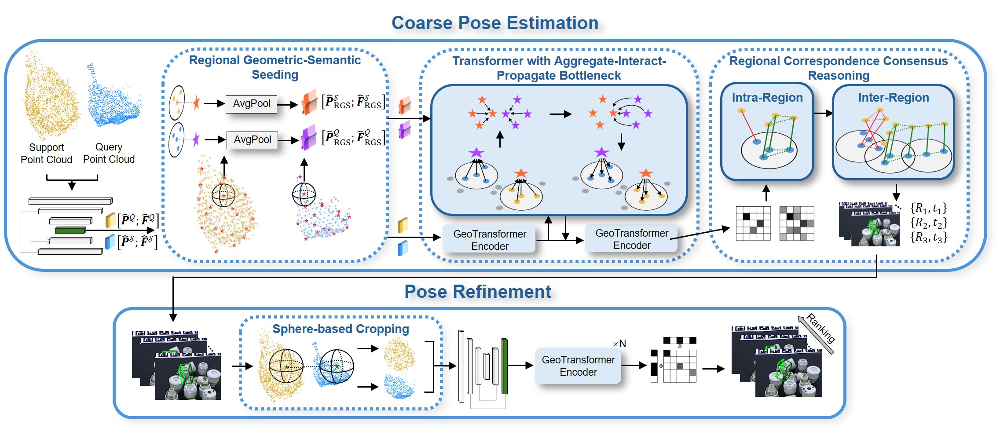

# RGA6D

This repo provides for the implementation of the RAL 2026:

**RGA6D: Regional Geometry-Aware Correspondence Reasoning for Depth-only Model-Free 6D Pose Estimation.** 

Qingyang Zhou, Ziheng Li, Qingzhen Li, and Ye Ding.

## Overview

In this letter, we present a depth-only model-free 6D pose estimation framework centered on regional geometry-aware 3D-3D correspondence reasoning: (1) We introduce a Transformer with an Aggregate-Interact Propagate bottleneck to learn noise-robust regional geometric representations for correspondence construction; (2) We propose Regional Correspondence Consensus Reasoning to hierarchically generate candidate alignments for resolving structural ambiguities; (3) Extensive experiments on challenging T-LESS dataset demonstrate that RGA6D achieves superior performance among existing baselines.



## News

2026.09.07: Code on T-LESS and LM release. Datasets and Models will be released soon.

2026.08.28: This work is accepted by RAL 2026. 

## Installation

Please use the following command for installation.

```bash
# Create and activate environment 
conda create -n rga6d python=3.10 -y 
conda activate rga6d 

# Install PyTorch with CUDA support
pip install torch==2.7.1 torchvision==0.22.1 torchaudio==2.7.1 --index-url [https://download.pytorch.org/whl/cu118](https://download.pytorch.org/whl/cu118) 
# Install dependencies from requirements.txt 
pip install -r requirements.txt

# Compile main RGA6D extensions 
python setup.py build develop 

# Compile RCCR modules 
cd models/RCCR/intra 
python setup.py build develop 
cd ../inter 
python setup.py build develop 
cd -

# build pointnet2 extention
cd models/pointnet2_ops_lib/
pip install -e .
cd -
```

<!-- ## Pre-trained Weights

We provide pre-trained weights in the [release]() page. Please download the latest weights and put them in `weights` directory. -->

## Data preparation

The large-scale training data and our pre-processed T-LESS & LineMOD benchmark datasets will be released soon. The data should be organized as follows:

```text
datasets/
├── lm
    ├──lm-1_8train-9_11val-12_15test  # provided by us
    ├──lm-8_13train-14_15val-1_6test  # provided by us
    └──lm-12_2train-4_6val-8_11test  # provided by us
├── tless
    ├──tless-1_16train-17_20val-21_30test  # provided by us
    ├──tless-11_26train-27_30val-1_10test  # provided by us
    └──tless-21_6train-7_10val-11_20test  # provided by us
├── RGA6D  # Our training dataset
    ├──train_0.pkl  # from GSO
    ├──train_1.pkl  
    ├──...  # the others are from Objaverse
    ├──val_0.pkl  # from GSO
    ├──val_1.pkl
    └──...  # the others are from Objaverse
└── BOP 
    ├──lm # download from BOP website
    └──tless # download from BOP website
```

## Training

Use the following commands to train RGA6D.

```bash 
# Pretraining on training dataset 
cd experiments/pretrain 
CUDA_VISIBLE_DEVICES=0 python train.py 

# Fine-tuning on T-LESS 
cd experiments/tless 
CUDA_VISIBLE_DEVICES=0 python train.py --snapshot /path/to/pretrained_weights.pth.tar
# Fine-tuning on LM 
cd experiments/lm 
CUDA_VISIBLE_DEVICES=0 python train.py --snapshot /path/to/pretrained_weights.pth.tar
```

Note: Before training, make sure to update config.py/config_train.py.

## Testing

Use the following command for testing.

```bash
# Fine-tuning on T-LESS 
cd experiments/tless
CUDA_VISIBLE_DEVICES=0 python test.py --snapshot /path/to/weights.pth.tar

# Fine-tuning on LM
cd experiments/lm
CUDA_VISIBLE_DEVICES=0 python test.py --snapshot /path/to/weights.pth.tar
```

<!-- ## Citation

```bibtex
``` -->

## Acknowledgements

- [GeoTransformer](https://github.com/qinzheng93/GeoTransformer)
- [MAC](https://github.com/zhangxy0517/3D-Registration-with-Maximal-Cliques)
- [UNOPose](https://github.com/shanice-l/UNOPose)
- [pointnet2_ops](https://github.com/erikwijmans/Pointnet2_PyTorch)
- [bop_toolkit](https://github.com/thodan/bop_toolkit)
